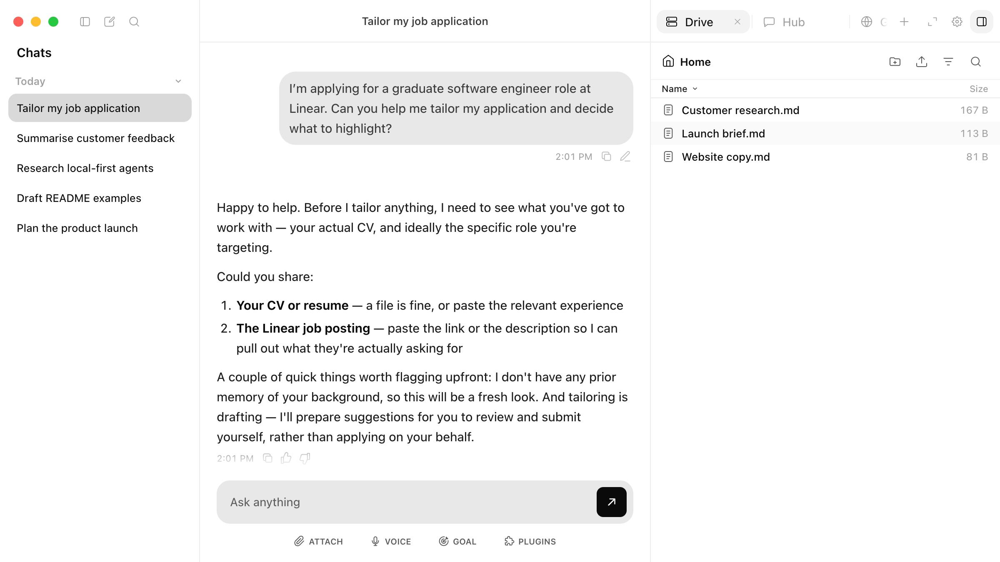
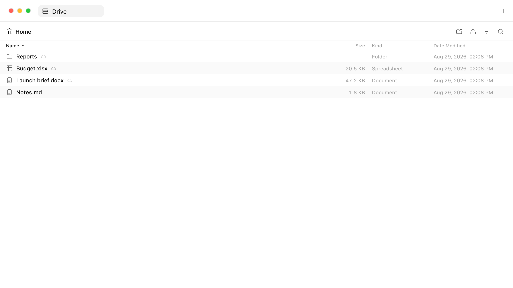
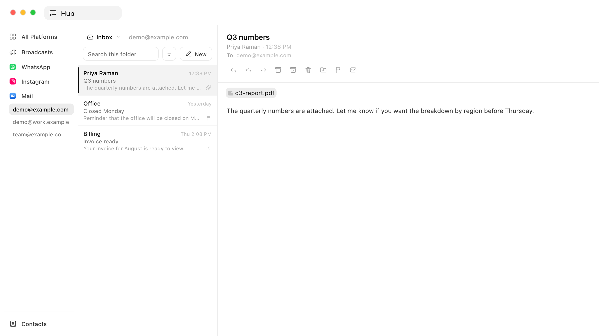
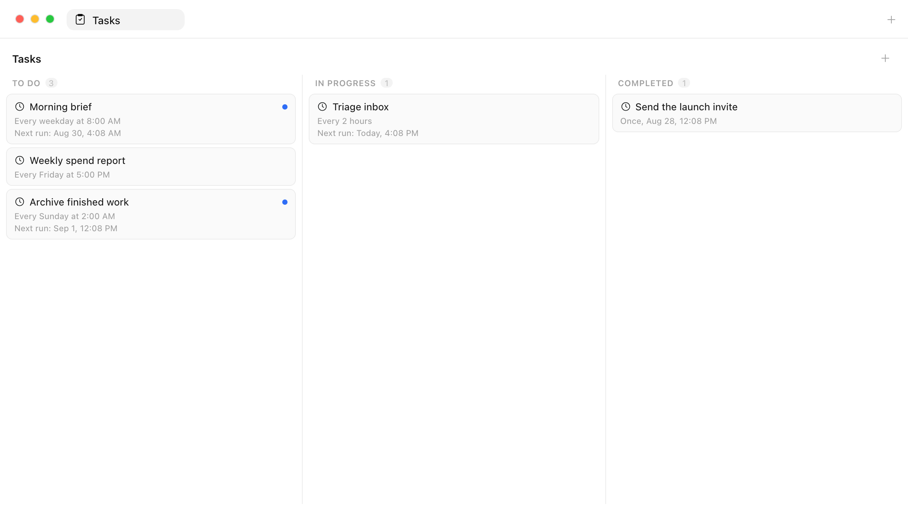

# Polymux

**The open-source ChatGPT desktop app—with messaging, social media, a virtual
drive, browser automation, and more built in.**

  

<table>
  <tr>
    <td width="50%"></td>
    <td width="50%"></td>
  </tr>
  <tr>
    <td align="center">Drive</td>
    <td align="center">Hub</td>
  </tr>
  <tr>
    <td width="50%"></td>
    <td width="50%"></td>
  </tr>
  <tr>
    <td align="center">Browser</td>
    <td align="center">Tasks</td>
  </tr>
</table>

Polymux is an agent-agnostic desktop workspace built with Electron and TypeScript.
It bundles Polymux Agent by default, while profiles can instead connect an external
agent over the open Agent Client Protocol (ACP). Its core
capabilities include **Hub**, a central communication layer supporting around 17
platforms, including email; **Drive**, a virtual filesystem backed by local and
popular cloud storage; **Schedule**, for creating cron jobs; **Browser**, with both
external and in-app browsing; **Workspace**, a tabbed interface for accessing every
core feature; and a fast, grep-based **Memory** system, complemented by **ComputerHistory**
for understanding your computer-use history.

The main agent can delegate focused work to parallel **Subagents**, keeping the
primary chat coherent while specialised work runs independently. The chat-scoped
**Tasks** board tracks work that needs attention and its progress. Basic mode offers
a simple plug-and-play experience; Advanced mode exposes additional configuration
for those who want more control.

Polymux is desktop-only for now. This is an intentional starting point: a local
environment offers an agent broad capabilities with fewer restrictions, while the
architecture can be extended to a web or cloud-backed deployment later.

**macOS currently has the best support.** Polymux is also available for Windows and
Linux, but those platforms do not yet have the same depth of UI testing or feature
coverage as the macOS version. Some integrations and platform-specific features may
therefore behave differently or remain unavailable outside macOS.

## Backend

- `agent-runtime` is the host boundary shared by Polymux Agent and external ACP agents.
- `core` owns the provider-neutral agent loop, streaming events, cancellation, steering, and tool execution.
- `agent` adds Polymux policy: layered prompts, Pi-compatible skills, file-backed local memory, goals, compaction, and simple subagents.
- `inference` is a thin adapter over `pi-ai`.
- `tools` provides only `read`, `bash`, `edit`, and `write` by default, plus MCP connections.
- `storage` persists chats, runs, replayable events, goals, compaction summaries, artifacts, and references in SQLite.
- `protocol` defines and validates the secure Electron main/preload API.

There is no project layer or team system in the backend, which is the intended
design for simplicity of use.

ACP runtimes are configured per profile in **Settings → Profile → Agent**. Polymux
owns the conversation, run history, rendering, and permission decision; the selected
runtime owns the agent session and streams its work through the same UI.

## Development

See [DEVELOPMENT.md](docs/DEVELOPMENT.md) for setup instructions, development commands,
bridge binaries, storage providers, skills, MCP, and memory details.
